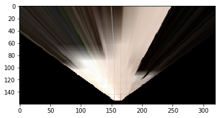
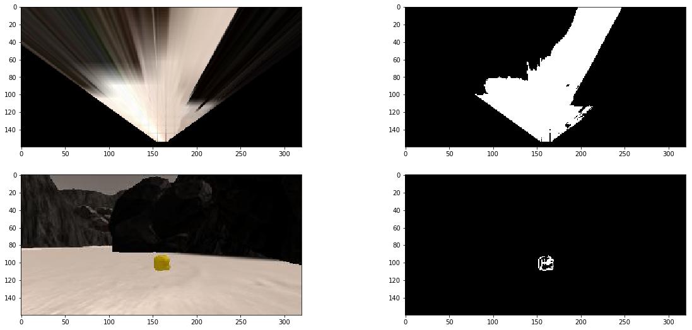
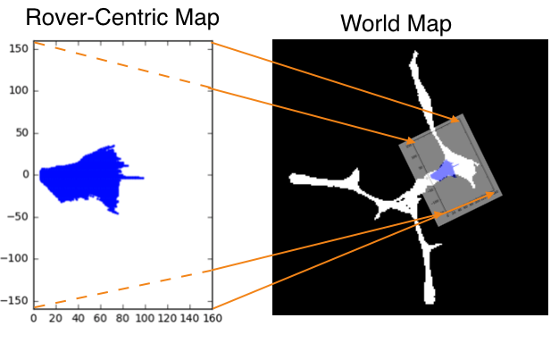
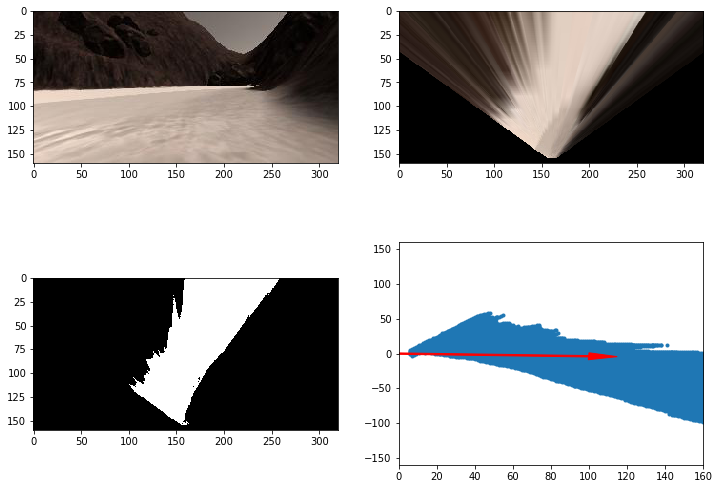

# Search and Sample Return Project


This project is modeled after the [NASA sample return challenge](https://www.nasa.gov/directorates/spacetech/centennial_challenges/sample_return_robot/index.html) and it will give you first hand experience with the three essential elements of robotics, which are perception, decision making and actuation.  You will carry out this project in a simulator environment built with the Unity game engine.  

**The goals / steps of this project are the following:**  

**Training / Calibration**  

* Download the simulator and take data in "Training Mode"
* Test out the functions in the Jupyter Notebook provided
* Add functions to detect obstacles and samples of interest (golden rocks)
* Fill in the `process_image()` function with the appropriate image processing steps (perspective transform, color threshold etc.) to get from raw images to a map.  The `output_image` you create in this step should demonstrate that your mapping pipeline works.
* Use `moviepy` to process the images in your saved dataset with the `process_image()` function.  Include the video you produce as part of your submission.

**Autonomous Navigation / Mapping**

* Fill in the `perception_step()` function within the `perception.py` script with the appropriate image processing functions to create a map and update `Rover()` data (similar to what you did with `process_image()` in the notebook). 
* Fill in the `decision_step()` function within the `decision.py` script with conditional statements that take into consideration the outputs of the `perception_step()` in deciding how to issue throttle, brake and steering commands. 
* Iterate on your perception and decision function until your rover does a reasonable (need to define metric) job of navigating and mapping.  

## Writeup

### Notebook Analysis

The notebook mainly breakdown the perception process into several small steps, which let us to easily visualize the functionality of the step and effectively parameters tunning or selection of difference methods to acheive the function. The steps includes:

**Perspective Transform**

To transform the camera images coming from the rover to shift them from the rover's view to bird view

Here is the image applied perspective transformation:



**Color Thresholding**

In order to identify navigable terrain, obstacles and rock samples, color thresholding is used. 

Threshold of RGB > 160 does a nice job of identifying ground pixels and will be considered as navigable terrain whereas for obstacles, it is just the invert of nvaigable terrain.

While, the range between rgb_lower_thresh=(100, 100, 0) and rgb_upper_thresh=(210, 210, 55) will be classified as rock samples.

The following is the snippet code of color thresholding:

```python
# Identify pixels above the threshold
# Threshold of RGB > 160 does a nice job of identifying ground pixels only
def color_thresh(img, rgb_thresh=(160, 160, 160)):
    # Create an array of zeros same xy size as img, but single channel
    color_select = np.zeros_like(img[:,:,0])
    # Require that each pixel be above all three threshold values in RGB
    # above_thresh will now contain a boolean array with "True"
    # where threshold was met
    above_thresh = (img[:,:,0] > rgb_thresh[0]) \
                & (img[:,:,1] > rgb_thresh[1]) \
                & (img[:,:,2] > rgb_thresh[2])
    # Index the array of zeros with the boolean array and set to 1
    color_select[above_thresh] = 1
    # Return the binary image
    return color_select

# Identify rocks
def rock_thresh(img, rgb_lower_thresh=(100, 100, 0), rgb_upper_thresh=(210, 210, 55)):
    # Create an array of zeros same xy size as img, but single channel
    color_select = np.zeros_like(img[:,:,0])
    # Require that each pixel be between all three threshold values in RGB
    # lower_thresh and upper_thresh will now contain a boolean array with "True"
    # where threshold was met
    between_thresh = ((img[:,:,0] > rgb_lower_thresh[0]) & (img[:,:,0] < rgb_upper_thresh[0])) \
                & ((img[:,:,1] > rgb_lower_thresh[1]) & (img[:,:,1] < rgb_upper_thresh[1])) \
                & ((img[:,:,2] > rgb_lower_thresh[2]) & (img[:,:,2] < rgb_upper_thresh[2]))
    # Index the array of zeros with the boolean array and set to 1
    color_select[between_thresh] = 1
    # Return the binary image
    return color_select
```

Here is the images shown the results of color thresholding:



**Coordinate Transformations**

Mapping from rover coordinate to world coordinates. The environment navigating by the rover in this project is roughly 200 x 200 meters and looks like the image above from a top-down view. The white areas represent the navigable terrain. The goal in this part is to use the rover's position, orientation and camera image to map its environment.



Here is the output result:




We also combined the previous processing steps to demonstrates the whole result. The following links to youtube video to show the result:

<p align="center">
    <a href="https://www.youtube.com/watch?v=b4b5K0qPzbw">
        
    </a>
</p>


### Autonomous Navigation and Mapping

#### How to test the autonomus navigation and mapping

Calling `drive_rover.py` at the command line like this:

```sh
python drive_rover.py
```  

Then launch the simulator and choose "Autonomous Mode".  The rover should drive itself now!  It doesn't drive that well yet, but it's your job to make it better!  

#### The perception_step() and decision_step()

**Perception Step**

Bascially, the content of perception_step() is already there when completed the notebook analysis. The notebook help to try the esseintal steps of perception and tunning it parameters.

It included the following several steps:
1) Define source and destination points for perspective transform
2) Apply perspective transform
3) Apply color threshold to identify navigable terrain/obstacles/rock samples
4) Update Rover.vision_image (this will be displayed on left side of screen)
5) Convert map image pixel values to rover-centric coords
6) Convert rover-centric pixel values to world coordinates
7) Update Rover worldmap (to be displayed on right side of screen)
8) Update vision image with visiting time

**Decision Step**

The decision step will decide what is current mode and base on the current mode to drive the rover. It contains five mode:
1) **pickup** - the rover is executing pickup process
2) **go_to_rock** - when rover near a rock simple, the decision step will switch to go_to_rock mode and drive the rover to the sample
3) **forward** - moving forward
4) **turn** - turning direction
5) **stop** - swith to stop model when reaching corner or obstacle


#### Results

The rover is able to map at least 40% of the environment with 60% fidelity (accuracy) against the ground truth and is aslo able to locate and pick up at least one rock sample successfully. 

You may click the image below to view the simulation result.

<p align="center">
    <a href="https://www.youtube.com/watch?v=5so_vJRIJ5k">
        
    </a>
</p>

#### Improvement

There still are many rooms to improve, such as:
* better obstacle avoidance
* better method to escape from obstacle and sometime the rover would be trapped in obstacles 
* better algorithm to reduce repeated transverse 
